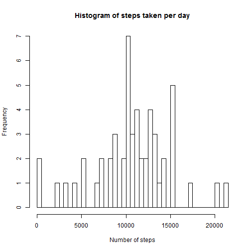
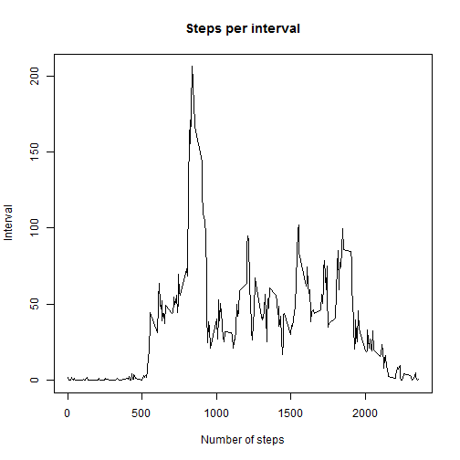
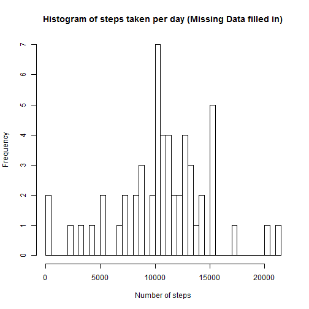
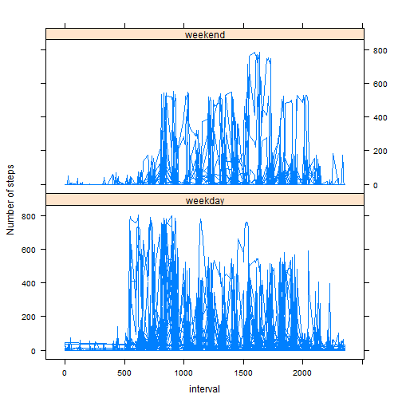

# Rmd file for class Reproducible Research Assignment 1


#### Set some defaults and load needed libraries


```r
library(lattice)
library(Defaults)
setDefaults('as.Date.character', format = '%Y-%m-%d')
```

#### Set the working directory and Read the input CSV file in the Data/ directory

(File has been uncompressed and is called activity.csv)


```r
setwd("C:\\Data\\On Line Classes\\Data Science Specializations\\Reproducable Results\\Assesment 1\\")
activity <- read.csv("Data/activity.csv", header = TRUE,
                     na.strings = "NA",
            colClasses= c("integer","Date","integer"))
```

#### In the first part of the analysis, any fields missing values (ie, value of "NA") the row is not used (Missing data is "ignored")


####Aggregate Steps by day


```r
steps_by_date <- aggregate(steps ~ date, activity,
                           na.action=na.omit,
                           sum)
```

####Print Histogram of Steps per day

```r
hist(steps_by_date$steps,xlab="Number of steps",breaks=length(unique(steps_by_date$steps)),
     main="Histogram of steps taken per day")
```

 

####Calculate the Mean and Median of the steps by day


```r
mean_num_steps <- mean(steps_by_date$steps)
median_num_steps <- median(steps_by_date$steps)
```

The mean number of steps by day is 10766 and the median number of steps by day is 10765.

####Find the average(mean) of the number of steps in the intervals


```r
steps_by_interval <- aggregate(steps ~ interval, activity,
                           na.action=na.omit,
                           mean)
```

####Plot the average(mean) number of steps per interval


```r
plot(steps_by_interval$interval, steps_by_interval$steps, type ='l',xlab="Number of steps",ylab="Interval",main="Steps per interval")
```

 

####Determine which interval has the most steps on average


```r
interval_max_steps <- steps_by_interval[max(steps_by_interval$steps),]$interval
```

The interval with the highest average number of steps was 1705.


####Determine how many rows have missing (i.e. "NA") values


```r
bad_rows <- sum(is.na(activity))
```

The number of rows with missing data is 2304.

####To make the data "cleaner" we will use the average(mean) number of steps per interval (already calculated above) to fill in any missing data


```r
new_activity <- activity
new_activity$steps <- ifelse((!is.na(new_activity$steps)),new_activity$steps,steps_by_interval[steps_by_interval$interval ==new_activity$interval,]$steps)
```


```r
steps_by_date_filled <- aggregate(steps ~ date, new_activity,
                           sum)
```

####Print Histogram of Steps per day with missing data filled in

```r
hist(steps_by_date_filled$steps,xlab="Number of steps",breaks=length(unique(steps_by_date_filled$steps)),
     main="Histogram of steps taken per day (Missing Data filled in)")
```

 

####Calculate the Mean and Median of the steps by day


```r
mean_num_steps_filled <- mean(steps_by_date_filled$steps)
median_num_steps_filled <- median(steps_by_date_filled$steps)
```

The mean number of steps by day is 10766 and the median number of steps by day is 10766.


####Check for a difference in the average(mean) and the median between the data with and without NA being filled in


```r
line1 <- c("There ","is not","a difference in the ","median")
line2 <- c("The difference is ","0000"," steps.")
if (mean_num_steps_filled == mean_num_steps) {
        line1[2] <- "is not"
        line1[4] <- "mean."
        mean_line <- paste(line1[1],line1[2],line1[3],line1[4])
} else {
        line1[2] <- "is"
        line1[4] <- "mean"
        line2[2] <- sprintf("%.4f",mean_num_steps_filled - mean_num_steps)
        mean_line <- paste(line1[1],line1[2],line1[3],line1[4],line2[1],line2[2],line2[3])
}

if (median_num_steps_filled == median_num_steps) {
        line1[2] <- "is not"
        line1[4] <- "median."
        median_line <- paste(line1[1],line1[2],line1[3],line1[4])
} else {
        line1[2] <- "is"
        line1[4] <- "median"
        line2[2] <- sprintf("%.4f",median_num_steps_filled - median_num_steps)
        median_line <- paste(line1[1],line1[2],line1[3],line1[4],line2[1],line2[2],line2[3])
}        
```


There  is not a difference in the  mean.

There  is a difference in the  median The difference is  0.5943  steps.

####Determine if the day is a Weekday or Weekend and then plot the difference in step per interval by Weekday / Weekend


```r
new_activity$weekend <- as.factor(ifelse(weekdays(new_activity$date) %in% c("Saturday","Sunday"),"weekend","weekday"))
xyplot(steps~interval | weekend, data= new_activity,type="l",ylab="Number of steps",layout =c(1,2))
```

 

